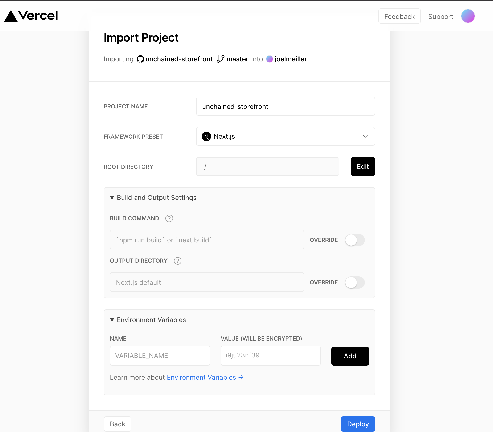

> In this section we will walk through on how to deploy your **Storefront** web app to [Vercel](https://vercel.com/)

This tutorial helps you:

- Deploy your web shop
- Publish the shop under your domain (or subdomain)

Make sure you have successfully completed the [Setup Shop](/getting-started-shop) guide.

## Step 1: Building the app

Before deploying we make sure our app bundles correctly by initiating a production build locally.
Navigate to the **Storefront** project and run the build command.

```bash
cd my-storefront-webapp

npm run build
```

This might take a moment. Once successful push everything to your git-repository.

```bash
git add .
git commit -m 'build version for deploy'
git push
```

If working on a specific branch, merge the branch into your **master** (or **main**) branch before continuing.

## Step 2: Connect the git with Vercel account

Create a Vercal account [here](https://vercel.com/signup). Once logged in you should see the setup window for your initial project.

You will need to allow Vercel to access your git repository. Once the repository is connected you should end up in the following screen:



## Step 3: Setup and run the deployment

Vercel detects automatically that your project is a Next.js app and will the build and deploy settings for you. No action required. 😎

However, we need to set some few **Environment Variables**.

| NAME               | VALUE                                          |
| ------------------ | ---------------------------------------------- |
| UNCHAINED_ENDPOINT |  https://your-unchained-instance.rocks/graphql |
| FRONTEND_URL       |  https://domain-of-your-frontend               |
| GRAPHQL_ENDPOINT   |  https://domain-of-your-frontend/api/graphql   |


Note there are other environment variables you can modify to suit your need while developing locally, below are all the environment variables you can customize with their default values.

```
FRONTEND_URL=http://localhost:3000
GRAPHQL_ENDPOINT=http://localhost:3000/api/graphql
NODE_ENV=development
SKIP_INVALID_REMOTES=false
UNCHAINED_CREATE_THEME=
UNCHAINED_CREATE_THEME_FILE=theme.json
DATATRANS_ENDPOINT=https://pay.sandbox.datatrans.com/upp/jsp/upStart.jsp
DATATRANS_MERCHANT=1100019919
```

3. Start up the storefront

Once you have set the correct environment variables and installed all the required dependencies run the following command to startup the storefront.

```
npm run dev
```

Now you have a fully functional storefront using unchained instance for API. Check it out by browsing to the following URLs:

- http://localhost:3000 to see the front-end (storefront)

See it in action by adding `Assortments` and `Products` etc... using the unchained control panel.

## Step 3: Deploy storefront with Vercel

Once you have set up the storefront template and run it locally successfully the last step we need to do is go live. while you can use any hosting provider for this demo we will be using vercel to handle the deployment since the storefront is also written with next.js.

1. upload storefront to Github.

2. Go to the official [vercel](https://vercel.com/) website and sign up for a new account.

3. Connect the repository where the storefront code is stored with vercel and give it access to all the necessary privileges.

4. set the required `env` production environment

```
UNCHAINED_ENDPOINT=https://your-unchained-instance.rocks/graphql
FRONTEND_URL=https://domain-of-your-frontend
GRAPHQL_ENDPOINT=https://domain-of-your-frontend/api/graphql
```

5. deploy the storefront

## Next steps

Get to know the concepts

- [Carts](concepts/carts)
